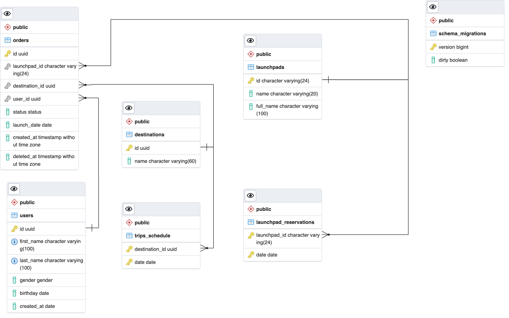

# Space Trouble

The project represents the configuration and setup server for Space Trouble project


[](https://goreportcard.com/report/github.com/vbetsun/space-trouble)

[](https://github.com/vbetsun/space-trouble)
[](https://pkg.go.dev/github.com/vbetsun/space-trouble)

## Structure 

The project consists of 2 parts:
- **API**  that handles all HTTP communication
- **Monitor** that actualizes information about SpaceX launches from their API
## Prerequisites

- Git
- Docker
- Docker Compose
  
## How to Install

Clone from github and navigate to the project's folder
```sh
# HTTPS
git clone https://github.com/vbetsun/space-trouble.git

# SSH
git clone git@github.com:vbetsun/space-trouble.git

cd space-trouble
```

## How to Deploy

```sh
cp ./deployments/.env.example ./deployments/.env
```

change env variables for your needs

```dotenv
PORT=8000 # port for serving API
DOCS_PORT=8080 # port for serving OpenAPI documentation

POSTGRES_PORT=5432 # port of postgre db
POSTGRES_HOST=localhost # host of postgre db
POSTGRES_PASSWORD=someStr0ngPass # password to psql
```

and start the application via `docker compose`. It should start the API server, monitor for actualizing data, PostgreSQL database, pgAdmin and OpenAPI documentation, which you can see on http://localhost:${DOCS_PORT}

```sh
docker compose -f ./deployments/docker-compose.yml up -d
```

after that you have to run migrations

```sh
make migrate-up
```

## Database structure



## How to Test

for testing our API we're going to use unit tests and Postman collection via Newman

```sh
make test # runs unit and integration tests

make test-e2e # this command runs e2e tests for running application
```
